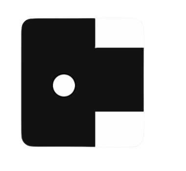
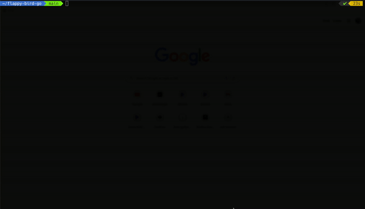
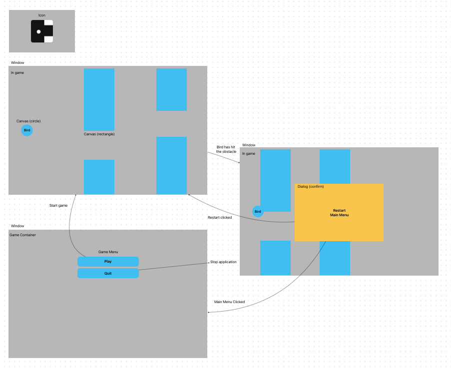

# Flappy Bird Go

# Content
- [Content](#content)
- [Introduction](#introduction)
- [Prerequisites](#prerequisites)
- [Further Improvement](#further-improvement)
- [How does the game work?](#how-does-the-game-work%3F)

# Introduction
The clone of the famous mobile game called <a href="https://flappybird.io/">"Flappy Bird"</a>.

Minimally written on programming language "Go".

# Prerequisites
* <a href="https://go.dev/">Go</a>
* <a href="https://developer.fyne.io/started/#prerequisites">Fyne.io</a>

# Further Improvement
<a href="https://github.com/users/star-light-nova/projects/3" target="_blank">Are in the issues or in the GitHub project</a>

# How does the game work?

